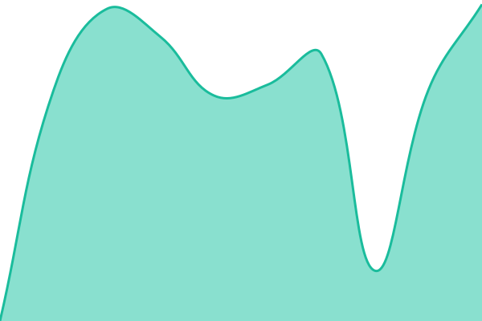

# [📈 Live Status](https://status.muenchner-furs.de): <!--live status--> **🟧 Partial outage**

This repository contains the open-source uptime monitor and status page for [Münchner Furs e. V.](muenchner-furs.de), powered by [Upptime](https://github.com/upptime/upptime).

With [Upptime](https://upptime.js.org), you can get your own unlimited and free uptime monitor and status page, powered entirely by a GitHub repository. We use [Issues](https://github.com/muenchnerfurs/status-page/issues) as incident reports, [Actions](https://github.com/muenchnerfurs/status-page/actions) as uptime monitors, and [Pages](https://status.muenchner-furs.de) for the status page.

<!--start: status pages-->
<!-- This summary is generated by Upptime (https://github.com/upptime/upptime) -->
<!-- Do not edit this manually, your changes will be overwritten -->
<!-- prettier-ignore -->
| URL | Status | History | Response Time | Uptime |
| --- | ------ | ------- | ------------- | ------ |
|  [muenchner-furs.de](https://muenchner-furs.de) | 🟥 Down | [muenchner-furs-de.yml](https://github.com/muenchnerfurs/status-page/commits/HEAD/history/muenchner-furs-de.yml) | 

 2017ms
     
 | 

<a href="https://status.muenchner-furs.de/history/muenchner-furs-de">99.67%</a>
    

|  [Eventanmeldung (Pretix)](https://reg.muenchner-furs.de) | 🟩 Up | [eventanmeldung-pretix.yml](https://github.com/muenchnerfurs/status-page/commits/HEAD/history/eventanmeldung-pretix.yml) | 

 1730ms
     
 | 

<a href="https://status.muenchner-furs.de/history/eventanmeldung-pretix">99.92%</a>
    

|  [furvaria.de](https://furvaria.de) | 🟩 Up | [furvaria-de.yml](https://github.com/muenchnerfurs/status-page/commits/HEAD/history/furvaria-de.yml) | 

 2083ms
     
 | 

<a href="https://status.muenchner-furs.de/history/furvaria-de">100.00%</a>
    

|  [donaufurs.de](https://donaufurs.de) | 🟩 Up | [donaufurs-de.yml](https://github.com/muenchnerfurs/status-page/commits/HEAD/history/donaufurs-de.yml) | 

 705ms
     
 | 

<a href="https://status.muenchner-furs.de/history/donaufurs-de">99.73%</a>
    

<!--end: status pages-->

[**Visit our status website →**](https://status.muenchner-furs.de)

## 📄 License

- Powered by: [Upptime](https://github.com/upptime/upptime)
- Code: [MIT](./LICENSE) © [Anand Chowdhary](https://anandchowdhary.com), supported by [Pabio](https://pabio.com)
- Data in the `./history` directory: [Open Database License](https://opendatacommons.org/licenses/odbl/1-0/)
